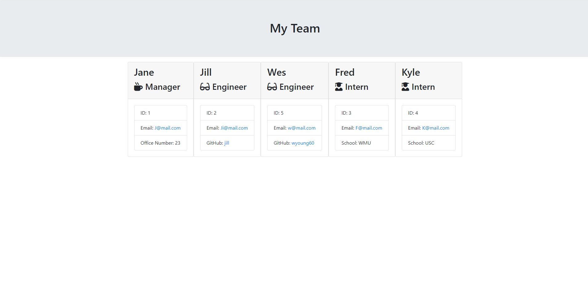

# teamProfileGenerator

## Description

CLI that takes in information about the user's team and creates a HTML reference sheet with employee's information.

## Table of Contents

- [Installation](#installation)

- [Usage](#usage)

- [Screenshot](#screenshot)

- [License](#license)

- [Tests](#tests)

- [Links](#links)

- [Questions](#questions)

## Installation

Install necessary dependencies with npm i command.

## Usage

This is command line application. Follow prompts to create team.html file.

## Screenshot

## License

Licensed under MIT license.

## Tests

Use npm test command to test repo.

## Links

https://github.com/wyoung60/teamProfileGenerator

## Questions

Email wesley.young@du.edu with any questions.
